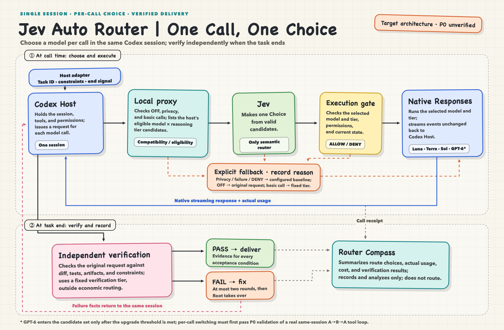

# Jev Auto Router

**Jev Auto Router (Jev Router) is an experimental per-call GPT model router for Codex: [TypeSafe's Jev](https://docs.typesafe.ai/introduction) makes the choice, and independent verification checks the finished task.**

In the architecture, Jev chooses the model and reasoning effort for each call. A local Responses proxy preserves the Codex session and tool loop. Independent verification checks the finished task. Router Compass connects the route, actual usage, and acceptance result to answer one question: **Did using less frontier capacity still complete the task correctly and reduce the full delivery cost?**

> [!IMPORTANT]
> **Status: architecture approved; runtime is a validation prototype.** This repository has a per-call proxy and tests, but cross-model switching in a real Codex tool loop, the complete verification path, and savings have not been proven end to end. The design below is not a production installation guide.

[简体中文](README.md) · [Architecture](docs/solution.md) · [Decision ADR 0017](docs/adr/0017-per-call-responses-routing.md) · [License](LICENSE)

## Prerequisites

- **A TypeSafe account and Jev API key.** Get a key through the [TypeSafe Quick Start](https://docs.typesafe.ai/introduction/quickstart). This proxy reads `JEV_API_KEY` when it calls Jev. TypeSafe's own examples use `TYPESAFE_API_KEY`; both variables can hold the same key. Never commit the key.
- **Node.js 22+, a signed-in Codex CLI, and access to the model and reasoning-effort pairs you want to route.** A Jev key alone does not make live per-call routing available.
- **This is still a validation prototype.** Cross-model switching inside a real Codex tool loop must pass the P0 proof below; there is no production-ready install-and-run path yet.

## Why route per call?

A coding task mixes hard reasoning about requirements or failures with routine calls to read files, make known edits, and follow up on tool results. Running every call on a frontier model spends scarce capacity on simple steps; running the whole task on a small model risks the difficult ones.

Jev Auto Router makes a choice at **each meaningful model call** inside the same session. It does not start a new worker for each task. For example, Sol could frame the problem, Luna Max handle explicit follow-up work, Terra resolve an ordinary implementation issue, and Sol analyze a failed test. This illustrates the routing granularity; it is not a measured outcome.

## The delivery loop



### What Jev does

- The proxy builds only `(model, reasoning effort)` pairs that the host can actually request. Jev makes **one Choice** over those pairs, selecting model and effort together. Local code adds no task-kind table or second semantic router.
- Jev receives compact state that passes an explicit send check, such as the current step, a bounded tool-error summary, and the current model. The full session still goes through the native Codex model call; raw prompts and tool output are not stored in route logs by default.
- Production routing pins a validated Jev version; `jev-latest` is evaluated in shadow. Timeout, low confidence, or an invalid answer falls back explicitly to `Terra/medium` by default, with a recorded reason. Turning the router off restores the host's original model.

### Four capability tiers

| Tier | Typical role | Ordinary calls |
| --- | --- | --- |
| **Luna Max** | Explicit, mechanical follow-up steps | Eligible |
| **Terra** | Everyday work and the fallback baseline | Eligible |
| **Sol** | Harder reasoning, implementation, and correction | Eligible |
| **GPT-6** | Scarce escalation supported by evidence | Ineligible by default |

GPT-6 enters the candidate set only with temporary eligibility from a verified reasoning blocker. An explicit user mandate for GPT-6 is enforced as a hard constraint. Luna Max means `gpt-5.6-luna/max` in the current design; tier names must match model and effort pairs that the host actually supports.

## A good route does not prove completion

At the task boundary, independent verification checks the original request against the diff, tests, run results, and any needed semantic judgment. The executing model's claim of success is not evidence. Specific failures return to the same session for correction; after two cycles by default, Root takes over. Verification uses a fixed tier outside the economic routing loop.

Router Compass records Jev's choice, the actual model and effort, usage, cache behavior, latency, and fallback reason for each call, then links those facts to the task's verification result. Unknown usage stays `UNKNOWN`, never zero. Switching models can lose prompt-cache reuse, so V1 measures the full cost instead of assuming routing saves money.

| Evidence | What it can establish |
| --- | --- |
| Production observation | Actual model mix, usage, and task verification |
| Historical replay | **Estimated** prices under explicit assumptions; a counterfactual, not quality proof |
| Fixed-Terra control | Whether equivalent acceptance and complete Jev/correction accounting show real savings with maintained quality |

## Current status

The repository contains a prototype local proxy, routing decisions, task verification, Compass data structures, and tests. The **P0 gate** is a real Codex CLI A→B→A switch within one tool loop across all four tiers, checking authentication, actual model and effort, tool-call IDs, streaming events, cancellation, continuation, and compaction. Until that proof and a controlled comparison pass, this project makes no general savings claim and offers no promise of automatic routing after installation.

The legacy plugin Skill and cover image still describe the TaskUnit/worker architecture. [ADR 0017](docs/adr/0017-per-call-responses-routing.md) and the [architecture](docs/solution.md) define per-call V1.

### Local development

Requires Node.js 22+. These commands validate the current code; they do not connect Codex to a production proxy:

```sh
npm ci
npm test
npm run typecheck
```

`npm test` builds before running tests. The local proxy entry point is [src/index.ts](src/index.ts).

## License

[Apache License 2.0](LICENSE)
