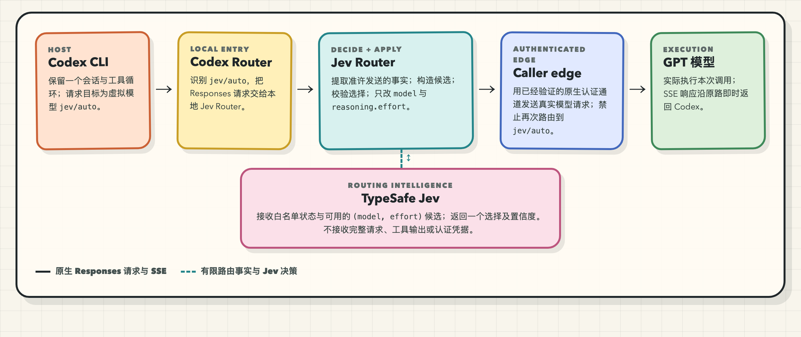
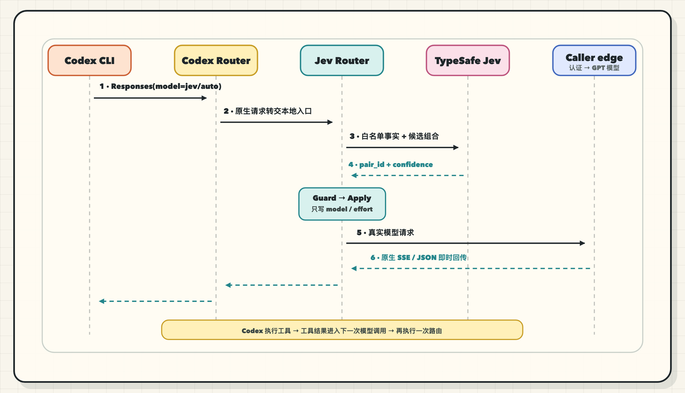

# Jev Auto Router

**One Codex session. A fresh model choice for each meaningful call.** [TypeSafe's Jev](https://docs.typesafe.ai/introduction) chooses from the available GPT model and reasoning-effort pairs; independent verification checks the finished task. Jev Auto Router (Jev Router) is a prototype of that design.

In the architecture, Jev chooses the model and reasoning effort for each call. A local Responses proxy preserves the Codex session and tool loop. Independent verification checks the finished task. Router Compass connects the route, actual usage, and acceptance result to answer one question: **Did using less frontier capacity still complete the task correctly and reduce the full delivery cost?**

The current lineup is **three GPT-6 tiers**: `gpt-6-luna` (Luna Max, heavy reasoning), `gpt-6-sol` (the workhorse, which also plays the fixed fallback-baseline role), and `gpt-6-astra` (absent from candidates by default; admitted only on evidence or explicit user mandate).

> [!IMPORTANT]
> **Status: the Scheme A runtime is implemented; live evidence is still being
> collected.** The fixed-baseline path, Shadow, controlled Active,
> cancellation propagation, pair-proof catalog, and paired-evaluation gates
> are in place and covered by deterministic HTTP tests. Repeatable live
> A→B→A, independent cancellation, post-compaction continuation, and the
> real paired release decision (local tickets 21–25) remain open. This is
> not a production installation guide.

[简体中文](README.md) · [Architecture](docs/solution.md) · [Decision ADR 0017](docs/adr/0017-per-call-responses-routing.md) · [Chinese article](https://minilv.github.io/2026/09/18/codex-auto-router/) · [License](LICENSE)

## Prerequisites

- **A TypeSafe account and Jev API key.** Get a key through the [TypeSafe Quick Start](https://docs.typesafe.ai/introduction/quickstart). This proxy reads `JEV_API_KEY` when it calls Jev. TypeSafe's own examples use `TYPESAFE_API_KEY`; both variables can hold the same key. Never commit the key.
- **Node.js 22+, a signed-in Codex CLI, and access to the model and reasoning-effort pairs you want to route.** A Jev key alone does not make live per-call routing available.
- **This is still a validation prototype.** The runtime follows Scheme A and
  passes deterministic tests, but real caller-edge proof assets, repeatable
  live sessions, and paired-evaluation results are still pending; there is no
  production install flow yet.

Before running the local proxy, set the key from your TypeSafe dashboard in the current shell:

```sh
export JEV_API_KEY="<your-typesafe-jev-api-key>"
```

## Why route per call?

A coding task mixes hard reasoning about requirements or failures with routine calls to read files, make known edits, and follow up on tool results. Running every call on a frontier model spends scarce capacity on simple steps; running the whole task on a small model risks the difficult ones.

Jev Auto Router makes a choice at **each meaningful model call** inside the same session. It does not start a new worker for each task. For example, Sol could frame the problem, Luna Max handle heavy reasoning, Sol continue routine implementation and tool follow-ups, and Astra join only for an evidenced reasoning blocker through its one-shot admission. This illustrates the routing granularity; it is not a measured outcome.

## The delivery loop

```text
Codex Responses(model=jev/auto)
   |
   v
Codex Router -- real-model request -> normal path (Jev bypassed)
   |
   v
local Jev Router -- OFF / privacy refusal / insufficient facts -> fixed Fallback Baseline
   |
   v
allowlisted Routing State + Candidate Pairs proved on the caller edge
   |
   v
pinned Jev: one Choice -> Guard -> Apply model + reasoning.effort only
   |                      failure/Shadow -> same fixed Fallback Baseline
   v
authenticated non-recursive caller edge -> native SSE / JSON returned immediately
```

### System topology

<p align="center">
  
</p>

The main line carries only native Codex Responses traffic; Jev is a routing side channel that receives allowlisted facts and candidate pairs, never upstream credentials. The virtual-model entry (`jev/auto`) and the authenticated caller edge stay separate to prevent recursive forwarding; user content reaches only the GPT upstream it was already bound for, through the local proxy. See the full [Scheme A visual technical design](tech-design.html).

### Interaction sequence

<p align="center">
  
</p>

Jev never becomes the executing model: it only hands the local router a constrained choice before the upstream call. Responses stream back before generation completes; the observer reads completion events on the side and never blocks or rewrites what Codex receives. Fallback is decided only before the upstream request starts; once output has begun, failures surface as-is and the same call is never replayed on another model.

### Six modules

| Module | Responsibility | Output |
| --- | --- | --- |
| M1 · Ingress | Receive the Responses request; identify session, call kind, user model, infrastructure calls | CallContext + native request |
| M2 · Admission & privacy | Build candidates from proved pairs; apply user hard constraints; extract allowlisted facts only | RoutingFacts + CandidatePairs |
| M3 · One Jev Choice | Pinned version, fixed question template, one deadline-bounded call | ProposedPair or failure reason |
| M4 · Guard + Apply | Validate membership, availability, constraints, confidence; rewrite only `model` and `reasoning.effort` | AppliedRequest + RouteSource |
| M5 · Relay | Call the verified caller edge; pass bytes through; propagate cancellation | Native SSE / JSON response |
| M6 · Observe | Record proposed vs applied vs observed pairs separately; missing values stay UNKNOWN, no raw text | Per-call audit record |

### What Jev does

- The router builds only exact `(model, reasoning effort)` pairs proved
  requestable through the current authenticated caller edge. Jev makes one
  Choice; local code adds no task-kind table or second semantic router.
- Jev receives compact state that passes an explicit send check, such as the current step, a bounded tool-error summary, and the current model. The full session still goes through the native Codex model call; raw prompts and tool output are not stored in route logs by default.
- Production routing pins a validated Jev version. OFF, privacy refusal,
  insufficient facts, timeout, low confidence, and invalid answers all use the
  same proved fixed baseline with distinct reasons. There is no product-wide
  default pair. A user-selected real model always bypasses Jev.
- **Astra admission is scarce.** `gpt-6-astra` is absent from candidates by
  default; it joins a call only through a one-shot eligibility opened by
  verified reasoning-blocker evidence (consumed on use) or an explicit user
  mandate (`x-jev-astra-mandate`). Ordinary failures never create persistent
  eligibility.

### Candidate Pairs

Candidates are exact `(model, reasoning_effort)` pairs, not brand tiers. A
pair enters the Choice only after the current caller edge has requested it
successfully and it satisfies capability and user hard constraints. Catalog or
model-picker visibility is not execution evidence. Current tiers are
`luna_max` / `sol` / `astra`.

## What data goes where

- **Sent to Jev:** only the compact state that passes an explicit send check — step type, current model, tool name, exit codes, fixed-length error digests. The full session never leaves the host for routing.
- **Sent upstream:** the native session content, exactly as it would flow without the proxy; the proxy never rewrites the response event stream.
- **Stored locally:** no raw prompts or tool output in default logs; sensitive content is refused outright rather than truncated, and calls without send eligibility skip Jev for the baseline.

## A good route does not prove completion

At the task boundary, the original request is checked against the diff, tests,
run results, and any needed semantic judgment. The executing model's claim of
success is not evidence. Route proposals and final delivery are evaluated
separately.

Router Compass records Jev's choice, the actual model and effort, usage, cache behavior, latency, and fallback reason for each call, then links those facts to the task's verification result. Unknown usage stays `UNKNOWN`, never zero. Switching models can lose prompt-cache reuse, so V1 measures the full cost instead of assuming routing saves money.

| Evidence | What it can establish |
| --- | --- |
| Production observation | Actual model mix, usage, and task verification |
| Historical replay | **Estimated** prices under explicit assumptions; a counterfactual, not quality proof |
| Fixed Fallback Baseline control | Whether equivalent acceptance and complete Jev/cache/failure/verification accounting show real savings with maintained quality |

## Current status

The Scheme A runtime lives in this repository: the fixed-baseline path,
Shadow/Active modes, the pair-proof catalog with derived catalog identity,
Jev version and policy binding, SSE terminal-failure attribution,
cancellation propagation, the controlled Active evaluation entry, and the
paired-evaluation gates are implemented and covered by deterministic HTTP
tests (local tickets 09–20 complete; 08 implemented pending live acceptance).
What remains open is real evidence and the release decision (tickets 21–25):
repeatable live A→B→A sessions, independent cancellation and post-compaction
continuation evidence, the preregistered paired evaluation, and real
quality/cost results. Until those pass, this project makes no general savings
or production-readiness claim.

[skills/jev-auto-router/SKILL.md](skills/jev-auto-router/SKILL.md) is the install-and-operate guide; the Skill itself never intercepts model calls — routing happens inside the local proxy.

### Try it (prototype)

Requires Node.js 22+. These commands start the local proxy and validate the current code; they do not connect Codex to a production proxy:

```sh
npm ci
npm run build
JEV_API_KEY="<your-key>" \
# Replace with a pair you have successfully requested through this caller edge,
# e.g. gpt-6-sol/medium
JEV_BASELINE="<verified-model>/<verified-effort>" \
JEV_UPSTREAM_BASE_URL="<authenticated-caller-edge-url>" npm start
curl -s localhost:8787/health          # router status, baseline, model catalog
npm test                               # builds, then runs the full suite
npm run typecheck
```

Evaluation and evidence tooling:

```sh
npm run bench:jev-smoke             # synthetic Jev integration smoke (no execution-quality claim)
npm run bench:active-evaluation     # local controlled Active evidence entry (evidence only, not a release report)
npm run bench:evaluate              # summarize the paired-evaluation JSON report (Active gate input)
```

### Local HTTP surface

| Method & path | Purpose |
| --- | --- |
| `POST /v1/responses` | Responses entry; `model=jev/auto` triggers per-call routing, real models pass through |
| `GET /health` | Router status, baseline requestability, proved pairs, catalog ID, proof exclusions |
| `GET /decisions` | Per-call and per-task audit records (no prompts or tool text) |
| `POST /__jev/task/<id>/verification` | Report the task-boundary verification result, linked to route records |

Control signals travel as `x-jev-*` request headers and never enter the forwarded body: `x-jev-task-id` (required), `x-jev-step` (step type), `x-jev-current-model`, `x-jev-context-size-bucket`, `x-jev-forced-model` (hard-constrain to one model), `x-jev-astra-mandate` (explicitly require Astra), and `x-jev-competing-authority` (skip Jev under another routing authority). Each call's outcome returns via the `x-jev-route` (`model:effort`) and `x-jev-route-source` response headers. User input is inspected locally for secrets and length-bucketed; only the bucket may enter routing state.

### Configuration

| Environment variable | Effect | Default |
| --- | --- | --- |
| `JEV_API_KEY` | TypeSafe Jev API key | required when routing is enabled |
| `JEV_ROUTER_OFF` | `1` = OFF: do not call Jev; use the fixed baseline for `jev/auto` | unset |
| `JEV_MODE` | `active` \| `shadow` (shadow logs would-be routes, executes the baseline) | `shadow` |
| `JEV_ACTIVE_CANDIDATES` | Exact `<model>/<effort>` candidate allowlist; when set it also scopes Shadow choices, and Active refuses to start without it | required explicitly for Active |
| `JEV_ACTIVE_EVIDENCE_FILE` | Paired-evaluation JSON report from `bench:evaluate`; Active checks its gates and runtime bindings | required explicitly for Active |
| `JEV_PAIR_PROOFS_FILE` | Reviewed caller-edge proof manifest for exact model/effort request success; startup does not probe models | unset means no pair is proved |
| `JEV_RELEASE_ID` | Runtime release ID matching the paired-evaluation report | required explicitly for Active |
| `JEV_VERSION` | Pinned production Jev version | `jev-1.13.0` |
| `JEV_BASELINE` | Fixed fallback pair successfully requested through the current caller edge | required explicitly; no universal default |
| `JEV_CONFIDENCE_FLOOR` | Confidence floor below which calls fall back | `0.55` |
| `JEV_DEADLINE_MS` | Hot-path Jev deadline (tuned from shadow latency) | `2000` |
| `JEV_PORT` | Local proxy port | `8787` |
| `JEV_UPSTREAM_BASE_URL` | Caller-edge URL that performs upstream authentication and does not recurse to this router; the router holds no upstream credentials | required explicitly |
| `JEV_CALLER_EDGE_ID` | Non-secret caller-edge version/configuration ID shown in `/health` evidence | `UNKNOWN` |
| `JEV_CANDIDATE_CATALOG_ID` | Optional expected catalog ID; the actual ID is derived from current caller-edge pair proofs and startup rejects a mismatch | unset |
| `JEV_ENDPOINT` | Jev API endpoint | TypeSafe endpoint |

The version-1 pair-proof JSON has a manifest header with `version`, `id`, `caller_edge_id` and `proofs`. Each entry records the exact `model`/`effort`, caller-edge ID, request and expiry times, HTTP and Responses results, observed model/effort, and a redacted evidence artifact ID, SHA-256 digest and fixed-enum summary. Only a successful, completed, unexpired request through the current edge with an exact observed-model match enters the Candidate Pairs; `observed_effort: "UNKNOWN"` stays an explicit observation gap. Request bodies, prompts, tool output and credentials are rejected. Startup reads `/models` and the manifest first, derives the catalog ID from the edge, canonical set of valid pairs and each pair's proof version, then validates the Active report. Model/proof ordering, session names and startup time do not enter the ID. Startup never sends paid probes. Automatic requests fail before the upstream call when the baseline lacks proof, and Active startup rejects any unproved configured candidate. Real proof assets require human review; this repository ships no fabricated sample.

The local proxy entry point is [src/index.ts](src/index.ts).

## License

[Apache License 2.0](LICENSE)
