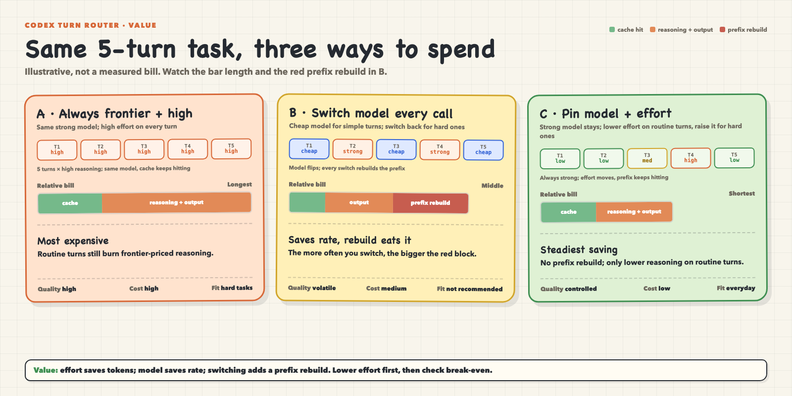

<h1 align="center">Jev Auto Router</h1>

<p align="center">
  <strong>One model decision per Codex user turn.</strong>
</p>

<p align="center">
  <code>jev-codex</code> launches the real Codex CLI, adds <code>Jev Auto Router</code> to the model picker, asks TypeSafe Jev once per fresh user turn, and keeps the selected model pinned through the tool loop. Effort moves through cache-preserving <code>configuration_update</code> items.
</p>

<p align="center">
  <a href="https://github.com/miniLV/Jev-Auto-Router/tags">Releases</a> ·
  <a href="https://minilv.github.io/Jev-Auto-Router/">Homepage</a> ·
  <a href="./README.md">简体中文</a> ·
  <strong>English</strong>
</p>

<p align="center">
  <a href="https://github.com/miniLV/Jev-Auto-Router/actions/workflows/ci.yml">
    
  </a>
  
  <a href="./LICENSE">
    
  </a>
  
  
</p>

<p align="center">
  
</p>

---

## 30-second version

If you use Codex and often spend `frontier + high effort` on routine turns:

- **one Jev decision per user turn**, not per model call;
- **the model stays pinned** through the tool loop, avoiding repeated prefix rebuilds;
- **effort is the fine control**, changed through `configuration_update` while preserving cache;
- price break-even, cache warmth, session guards and upgrade triggers are deterministic policy;
- supports **Codex CLI** and the **Codex app**.

> **Status:** `v0.1.0` alpha; 63 deterministic tests pass; live GPT cache/quality evaluation is still pending. Effort routing is off by default.

## What it does

| Capability | What it means |
| --- | --- |
| Turn-pinned routing | One Jev decision per user turn; the model does not change inside the tool loop |
| Effort routing | Same model; low/medium/high/xhigh/max can move per turn |
| Cache-aware gates | Price break-even, cache warmth, large-context and session guards |
| Codex CLI | `jev-codex` launches real Codex with the `Jev Auto Router` entry |
| Codex app | `jev-codex setup-app` configures the local provider and model catalog |
| Evidence | 63 deterministic tests; a live savings evaluation plan is in the repo |

- Design notes: [docs/codex-turn-router.md](docs/codex-turn-router.md)
- Evaluation plan: [docs/evaluation-plan.md](docs/evaluation-plan.md)
- Releasing: [docs/releasing.md](docs/releasing.md)


## Install

> [!IMPORTANT]
> The npm registry release does not exist yet (`npm view jev-auto-router` returns 404). Use the source install now; the npm commands below become available after the first publish.

### From source (available now)

```sh
git clone https://github.com/miniLV/Jev-Auto-Router.git
cd Jev-Auto-Router
npm ci
npm run build
npm link
jev-codex
```

### npm (after release)

```sh
npm install -g jev-auto-router
jev-codex
```

Or:

```sh
npx -y jev-auto-router
```

### Codex app

```sh
jev-codex setup-app
```

Then fully quit and reopen the ChatGPT/Codex app, create a new task, and select `Jev Auto Router`. See [Codex app](#codex-app) and [releasing](docs/releasing.md).

## Result: one extra model in the picker

`jev-codex` does not fork Codex. It launches the real Codex CLI, injects a temporary provider, and (by default) adds one virtual model to the Codex CLI model picker / `/model`:

```text
Jev Auto Router
GPT-6-Luna
GPT-5.6-Terra
GPT-5.6-Luna
...
```

Selecting `jev-auto` enables routing; selecting a real model bypasses it. This is the most visible integration result: **one extra model-list entry, not a separate agent.**

Notes:

- `JEV_API_KEY` / `TYPESAFE_API_KEY` is required. Without a key, `jev-codex` launches Codex without routing, and `jev-auto` will not appear.
- The Codex app uses the same local provider; configure it with `jev-codex setup-app`.
- The actual list depends on your account catalog; the model names above are illustrative.

### Codex CLI


The real Codex model picker: `Jev Auto Router` is the virtual entry; real models remain directly selectable.

### Codex app


Codex app: create a new task and select Jev Auto Router; existing tasks keep their original provider.

Configure the Codex app (ChatGPT/Codex app on macOS):

```sh
jev-codex setup-app
```

It will:

- back up `~/.codex/config.toml`;
- add `model_provider = "jev"` and the local provider;
- generate a model catalog containing `Jev Auto Router`;
- start the local proxy.

Then **fully quit** the ChatGPT/Codex app (`Cmd+Q`), reopen it, **create a new task**, and select `Jev Auto Router` in the model picker.


## Why turn-pinned, not every model call

```text
Session
└─ Turn: you send a message -> final answer
   ├─ Model Call 1
   ├─ Tool Call / Tool Result
   ├─ Model Call 2
   └─ ...
```

- **Model Call**: one request to a model. A request after a tool result is a new Model Call.
- **Tool Loop**: the model → tool → model cycle.
- **Turn**: from your message to the final answer.

Every model switch forces the new model to rebuild the prompt prefix. Deciding at the start of a turn and keeping the model fixed inside the tool loop limits rebuilds to at most one per user turn and avoids model oscillation mid-task.

Once the model is fixed, effort can move independently: use `configuration_update` to change the reasoning level, keep the request-level effort at its baseline, and replay earlier updates in place. The current implementation is **per-turn effort**, not per-step. That avoids an extra per-call classifier and never switches models just to change effort.

## Value: lower effort first, then model

Same 5-turn task, three ways to spend:

- **A**: always frontier + high — most expensive;
- **B**: switch model every call — saves rate, but adds a prefix rebuild;
- **C**: pin the model and move effort per turn — keeps the cache, less reasoning on routine turns.



Illustrative, not a measured bill. Real savings depend on the cache hit rate, the output/reasoning share, and quality. This is the project's main bet: **effort is the first lever; a model switch has to clear break-even.**

> [!WARNING]
> Alpha: effort routing is off by default, and `configuration_update` has not been validated against a live Codex + GPT cache yet. Set `JEV_CODEX_EFFORT_ROUTING=turn` for a small smoke test before enabling it long-term.

## Usage

Requires Node.js 22+, a signed-in Codex CLI, and a TypeSafe Jev key.

```sh
npm ci
npm run build
export JEV_API_KEY="<your-typesafe-jev-key>"
node bin/jev-codex.mjs
```

Or:

```sh
npm run codex      # build and launch the wrapper
npm link && jev-codex
```

All arguments are forwarded to Codex:

```sh
jev-codex resume --last
jev-codex exec "fix the failing test"
```

Without `JEV_API_KEY`, `jev-codex` still launches Codex; routing is simply disabled.

## What happens in a turn

```text
You send a message
  -> jev-codex launches real Codex with a temporary provider
  -> the proxy detects a fresh user turn
  -> ask Jev once: prompt + current model + context size + candidates
  -> policy gates: user override / low confidence / availability / price break-even / guards
  -> pin this turn's model + choose effort
  -> effort uses configuration_update; the model does not change
  -> the whole tool loop reuses the model; Jev is not asked again
  -> the next user turn may decide again
```

Selecting a concrete model in the picker bypasses automatic routing and passes the request through unchanged. Select `jev-auto` to resume routing.

## Policy

- User says `use <tier>` / `use <model>`: user wins.
- Jev failure, timeout, invalid answer, or low confidence: keep the current model.
- Low confidence never downgrades; upgrades cap at balanced.
- Large context blocks downgrades; upgrades are still possible. The threshold is a heuristic; both directions rebuild the cache.
- Session guard: stop auto-switching after 12 fresh turns; stay stable for at least one turn after a switch; optional switch cap.
- After 30 minutes idle, the guard resets. The model is retained, but the next turn may re-evaluate.
- With a price table, downgrades use break-even; without one, fall back to the fixed context threshold.
- Cache warmth comes from response usage; a cold cache lets a downgrade bypass the rebuild gate.
- Upgrades need a trigger: recent failure, high Jev complexity, or an explicit user request.
- If the target tier is unavailable, move up to the nearest available tier.
- Long tier is off by default; enable with `JEV_CODEX_ALLOW_LONG=1`.
- Explicit `use ...` always bypasses session guards.

## Configuration

Full configuration: [docs/codex-turn-router.md](docs/codex-turn-router.md).

| Variable | Default | Purpose |
| --- | --- | --- |
| `JEV_API_KEY` / `TYPESAFE_API_KEY` | required for routing | Jev key |
| `JEV_MODEL` | `jev-1.13.0` | Jev model |
| `JEV_CODEX_FAST_MODEL` | `gpt-6-luna` | fast tier |
| `JEV_CODEX_BALANCED_MODEL` | `gpt-6-sol` | balanced tier |
| `JEV_CODEX_STRONG_MODEL` | `gpt-6.1-sol` | strong tier |
| `JEV_CODEX_LONG_MODEL` | `gpt-6-astra` | long tier (off by default) |
| `JEV_CODEX_DOWNGRADE_MAX_CONTEXT_TOKENS` | `20000` | large-context downgrade gate |
| `JEV_CODEX_LOCK_AFTER_TURNS` | `12` | stop auto-switching after N turns (0 = off) |
| `JEV_CODEX_MAX_SWITCHES` | `0` | max switches per session (0 = unlimited) |
| `JEV_CODEX_SWITCH_COOLDOWN_TURNS` | `1` | stable turns after a switch |
| `JEV_CODEX_CACHE_TTL_MS` | `1800000` | idle time before guards reset |
| `JEV_CODEX_EFFORT_ROUTING` | `off` | set to `turn` to enable per-turn effort |
| `JEV_CODEX_EFFORT_CAP` | `high` | maximum effort |
| `JEV_CODEX_EFFORT_FALLBACK` | `high` | effort when scores are missing |
| `JEV_CODEX_PRICES` | unset | per-model price JSON for break-even |
| `JEV_CODEX_TASK_TURN_BUDGET` | `0` | expected task turns (0 = off) |
| `JEV_CODEX_UPGRADE_MODE` | `triggered` | upgrade trigger mode |
| `JEV_CODEX_SESSION_FILE` | `~/.codex-router/sessions.json` | persisted session pin |
| `JEV_CODEX_STRIP_ENCRYPTED_REASONING` | off | strip encrypted reasoning across models |
| `JEV_CODEX_COMMENTARY` | `1` | show routing result in Codex |
| `JEV_CODEX_LOG_FILE` | `~/.codex-router/decisions.jsonl` | redacted decision log |

The decision log stores prompt hash, length, model, tier, confidence, reason, context size and Jev scores. It never stores prompt text.

## Development

```sh
npm run typecheck
npm test
npm start          # proxy only, for debugging
```

Code layout:

```text
src/codex-router/
├─ cli.ts       launch real Codex with a temporary provider
├─ proxy.ts     /models injection, turn detection, model pin, streaming proxy
├─ policy.ts    overrides, confidence, availability, cache downgrade gates
├─ turn.ts      fresh user turn detection and conversation key
├─ jev.ts       Jev request construction, timeout, retry, response parsing
├─ config.ts    tiers, env config, candidate models
├─ cache.ts     price break-even and dynamic locks
├─ effort.ts    effort mapping and configuration_update replay
├─ usage.ts     response usage / cache warmth scanner
├─ session-store.ts  persisted session pin
├─ log.ts       redacted JSONL decision log
└─ types.ts     shared types
```

## Known boundaries

- Context size is estimated from serialized input length, excluding tools; the threshold is heuristic, not an exact token count.
- Price break-even requires a price table; without one it falls back to the fixed context threshold.
- Session pin is persisted locally per user; another machine will re-evaluate.
- Break-even uses estimated output and remaining-turn values, not a provider invoice.
- Encrypted reasoning cleanup is opt-in; compaction still needs live-session tests.
- Commentary modifies the Codex event stream; set `JEV_CODEX_COMMENTARY=0` for byte-identical forwarding.

## Release status

- Version: `0.1.0`
- Git tag: `v0.1.0`
- npm registry: **not published**
- Release process: [docs/releasing.md](docs/releasing.md)
- CI: `.github/workflows/ci.yml`
- Release workflow: `.github/workflows/release.yml` (tag `v*` or manual)

## License

[Apache License 2.0](LICENSE)
