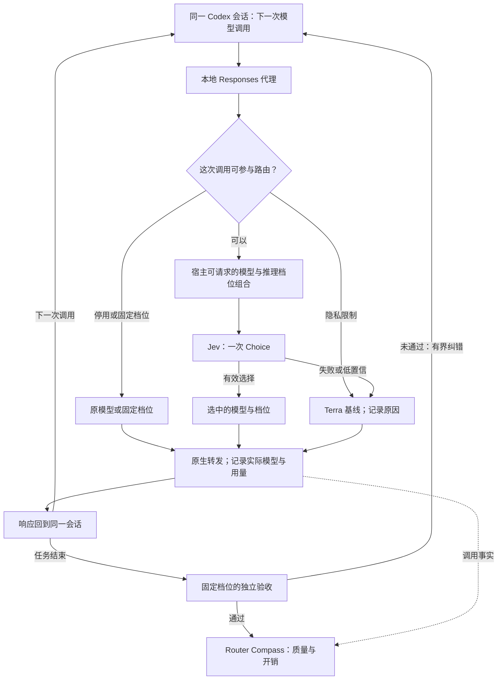

# Jev Auto Router

**让 Codex 在同一任务中按模型调用选择合适的 GPT 档位，并验证最终交付是否真的完成。**

架构中，Jev 负责每次调用的模型与推理档位选择；本地 Responses 代理负责保持 Codex 会话和工具循环连续；任务结束后独立验收。Router Compass 把选路、实际用量和验收结果放在一起，回答一个问题：**少用旗舰模型之后，任务是否仍然正确完成，整体开销是否真的下降？**

> [!IMPORTANT]
> **当前状态：架构已定，运行时处于原型验证阶段。** 仓库已有逐调用代理与测试，但真实 Codex 工具循环中的跨模型切换、完整验收链和节省效果尚未通过端到端验证。请勿把下面的设计当作已经可投入生产的安装说明。

[English](README.en.md) · [架构方案](docs/solution.md) · [架构决策 ADR 0017](docs/adr/0017-per-call-responses-routing.md) · [许可证](LICENSE)

## 为什么是逐调用路由

一个编码任务既有理解需求、排查复杂故障的高强度推理，也有读取文件、执行已知修改、跟进工具结果的常规调用。整段任务固定使用旗舰模型，会让简单调用占用昂贵能力；整段任务固定使用轻量模型，又可能拖累困难环节。

Jev Auto Router 把选择点放在**每次有意义的模型调用**上，而不是为每个任务启动一个新 worker。例如，同一个会话可以由 Sol 理清问题，Luna Max 执行明确的后续步骤，Terra 处理一般实现问题，再由 Sol 分析失败测试。这个序列仅用于说明路由粒度，不代表实测效果。

## 核心闭环



### Jev 做什么

- 代理只构建宿主当前**确实可请求**的 `(模型, reasoning effort)` 组合。Jev 对这些组合做**一次 Choice**，同时决定模型和推理档位；本地代码不再添加任务类型表或第二个语义选路器。
- 发给 Jev 的是经过发送资格检查的紧凑状态，例如当前步骤、工具错误摘要和当前模型。完整会话仍走 Codex 原生模型调用；原始 prompt 和工具输出默认不写入路由日志。
- 生产路由使用经过验证的 Jev 固定版本；`jev-latest` 用于 shadow 对比。超时、低置信或无效回答会明确回退到默认 `Terra/medium`，并留下原因。关闭路由时恢复宿主原本指定的模型。

### 四个能力档位

| 档位 | 典型职责 | 普通调用 |
| --- | --- | --- |
| **Luna Max** | 明确、机械的后续步骤 | 可选 |
| **Terra** | 日常实现与故障回退基线 | 可选 |
| **Sol** | 较难的推理、实现与纠错 | 可选 |
| **GPT-6** | 有证据支持的稀缺升级 | 默认不可选 |

GPT-6 仅在已验证的推理阻塞提供临时资格时进入候选集；用户明确要求 GPT-6 时，该要求作为硬约束执行。当前方案中的 Luna Max 指 `gpt-5.6-luna/max`；档位名称最终以宿主实际支持的模型与 effort 组合为准，不能靠名称假定模型可用。

## 路由正确，还不等于任务完成

任务边界有独立验收：对照原始需求检查改动、测试、运行结果和必要的语义结论；执行模型自报成功不算证据。验收失败时，把具体失败事实送回同一会话纠错；默认最多两轮，之后由 Root 接管。验收本身使用固定档位，不参与节省型路由。

Router Compass 记录每次调用的 Jev 选择、实际模型与档位、用量、缓存、延迟和回退原因，再关联任务的验收结果。未知用量保持 `UNKNOWN`，不能当成零。模型切换可能损失 prompt cache，因此 V1 先测量切换的真实代价，不声称路由天然省钱。

| 证据 | 可以回答的问题 |
| --- | --- |
| 生产观察 | 实际用了哪些模型、花了多少、任务是否通过验收 |
| 历史回放 | 在明确假设下，**估算**其他路线可能的价格；属于反事实，不证明质量 |
| 固定 Terra 对照 | 在同等验收、完整计入 Jev 与纠错开销后，是否真的节省并保持质量 |

## 当前进度与体验

当前仓库提供本地代理、路由决策、任务验收和 Compass 数据结构的原型及测试。**上线前的 P0 门槛**是用真实 Codex CLI 和四档模型完成同一工具循环中的 A→B→A 切换，核对认证、实际模型与 effort、工具调用 ID、流式事件、取消、延续和上下文压缩。通过这项验证和受控对照前，项目不宣称普遍节省，也不提供“安装后即可自动路由”的承诺。

仓库里的旧版插件 Skill 与封面仍反映 TaskUnit/worker 架构；逐调用 V1 以 [ADR 0017](docs/adr/0017-per-call-responses-routing.md) 和[架构方案](docs/solution.md)为准。

### 本地开发

需要 Node.js 22+。以下命令验证当前代码，不会建立 Codex 的生产代理连接：

```sh
npm ci
npm test
npm run typecheck
```

`npm test` 会先构建再运行测试；本地代理入口见 [src/index.ts](src/index.ts)。

## License

[Apache License 2.0](LICENSE)
