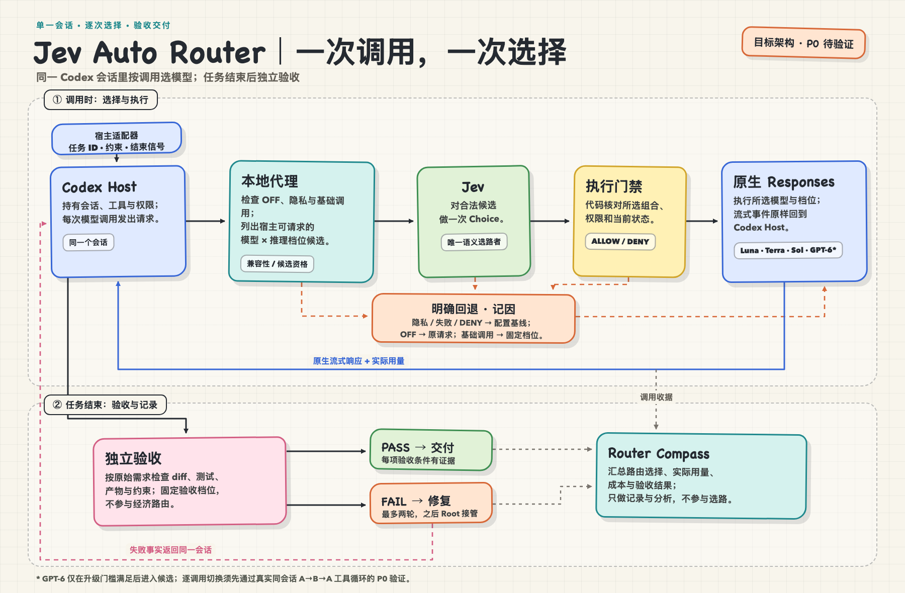

# Jev Auto Router

**一个 Codex 会话，每次模型调用重新选档。** [TypeSafe 的 Jev](https://docs.typesafe.ai/introduction) 从当前可用的 GPT 模型与推理档位中做一次选择；任务结束后再独立验收。这是 Jev Auto Router（Jev Router）的验证原型。

架构中，Jev 负责每次调用的模型与推理档位选择；本地 Responses 代理负责保持 Codex 会话和工具循环连续；任务结束后独立验收。Router Compass 把选路、实际用量和验收结果放在一起，回答一个问题：**少用旗舰模型之后，任务是否仍然正确完成，整体开销是否真的下降？**

> [!IMPORTANT]
> **当前状态：架构已定，运行时处于原型验证阶段。** 仓库已有逐调用代理与测试，但真实 Codex 工具循环中的跨模型切换、完整验收链和节省效果尚未通过端到端验证。请勿把下面的设计当作已经可投入生产的安装说明。

[English](README.en.md) · [架构方案](docs/solution.md) · [架构决策 ADR 0017](docs/adr/0017-per-call-responses-routing.md) · [中文文章](https://minilv.github.io/2026/09/18/codex-auto-router/) · [许可证](LICENSE)

## 前置条件

- **TypeSafe 账号与 Jev API key。** 按 [TypeSafe Quick Start](https://docs.typesafe.ai/introduction/quickstart) 从控制台获取密钥。当前代理调用 Jev 时读取环境变量 `JEV_API_KEY`；TypeSafe 官方示例使用 `TYPESAFE_API_KEY`，两者可以设置为同一密钥。不要将密钥提交到仓库。
- **Node.js 22+、已登录的 Codex CLI，以及宿主实际可请求的模型与推理档位。** 仅有 Jev 密钥不足以运行真实的逐调用路由。
- **目前是验证原型。** 真实 Codex 工具循环中的跨模型切换仍须通过下文的 P0 验证，尚无开箱即用的生产安装流程。

本地运行代理前，把 TypeSafe 控制台获取的密钥放进当前 shell：

```sh
export JEV_API_KEY="<your-typesafe-jev-api-key>"
```

## 为什么是逐调用路由

一个编码任务既有理解需求、排查复杂故障的高强度推理，也有读取文件、执行已知修改、跟进工具结果的常规调用。整段任务固定使用旗舰模型，会让简单调用占用昂贵能力；整段任务固定使用轻量模型，又可能拖累困难环节。

Jev Auto Router 把选择点放在**每次有意义的模型调用**上，而不是为每个任务启动一个新 worker。例如，同一个会话可以由 Sol 理清问题，Luna Max 执行明确的后续步骤，Terra 处理一般实现问题，再由 Sol 分析失败测试。这个序列仅用于说明路由粒度，不代表实测效果。

## 核心闭环



```text
Codex Responses 调用
   │
   ▼
本地代理 ── OFF？→ 宿主原模型 · 基础设施/验收调用 → 固定档位 · 隐私不过 → 跳过 Jev
   │
   ▼
紧凑路由状态 + 宿主当前可请求的 (模型, effort) 候选对
   │
   ▼
Jev 一次 Choice（生产 pin 版本）──超时/低置信/坏输出──► Terra/medium 基线（记录原因）
   │
   ▼
原生 Responses 转发（事件流不变）；记录实际模型与用量
   │
   └─任务结束─► 独立验收 PASS / FAIL ── 失败事实回同一会话纠错，两轮后 Root 接管
```

### Jev 做什么

- 代理只构建宿主当前**确实可请求**的 `(模型, reasoning effort)` 组合。Jev 对这些组合做**一次 Choice**，同时决定模型和推理档位；本地代码不再添加任务类型表或第二个语义选路器。
- 发给 Jev 的是经过发送资格检查的紧凑状态，例如当前步骤、工具错误摘要和当前模型。完整会话仍走 Codex 原生模型调用；原始 prompt 和工具输出默认不写入路由日志。
- 生产路由使用经过验证的 Jev 固定版本；`jev-latest` 用于 shadow 对比。超时、低置信或无效回答会明确回退到默认 `Terra/medium`，并留下原因。关闭路由时恢复宿主原本指定的模型。

### 四个能力档位

| 档位 | 典型职责 | 普通调用 |
| --- | --- | --- |
| **Luna Max** | 明确、机械的后续步骤 | 可选 |
| **Terra** | 日常实现与故障回退基线 | 可选 |
| **Sol** | 较难的推理、实现与纠错 | 可选 |
| **GPT-6** | 有证据支持的稀缺升级 | 默认不可选 |

GPT-6 仅在已验证的推理阻塞提供临时资格时进入候选集；用户明确要求 GPT-6 时，该要求作为硬约束执行。当前方案中的 Luna Max 指 `gpt-5.6-luna/max`；档位名称最终以宿主实际支持的模型与 effort 组合为准，不能靠名称假定模型可用。

## 什么数据去哪里

- **发给 Jev 的**只有通过发送资格检查的紧凑状态：步骤类型、当前模型、工具名、退出码、定长错误摘要。完整会话永不因路由外发。
- **上游模型调用**携带原生会话内容，与未安装代理时相同；代理不改写响应事件流。
- **本地日志**默认不保存原始 prompt 与工具输出；敏感内容直接拒发（不是截断），无发送资格的调用跳过 Jev 走基线。

## 路由正确，还不等于任务完成

任务边界有独立验收：对照原始需求检查改动、测试、运行结果和必要的语义结论；执行模型自报成功不算证据。验收失败时，把具体失败事实送回同一会话纠错；默认最多两轮，之后由 Root 接管。验收本身使用固定档位，不参与节省型路由。

Router Compass 记录每次调用的 Jev 选择、实际模型与档位、用量、缓存、延迟和回退原因，再关联任务的验收结果。未知用量保持 `UNKNOWN`，不能当成零。模型切换可能损失 prompt cache，因此 V1 先测量切换的真实代价，不声称路由天然省钱。

| 证据 | 可以回答的问题 |
| --- | --- |
| 生产观察 | 实际用了哪些模型、花了多少、任务是否通过验收 |
| 历史回放 | 在明确假设下，**估算**其他路线可能的价格；属于反事实，不证明质量 |
| 固定 Terra 对照 | 在同等验收、完整计入 Jev 与纠错开销后，是否真的节省并保持质量 |

## 当前进度与体验

当前仓库提供本地代理、路由决策、任务验收和 Compass 数据结构的原型及测试。**上线前的 P0 门槛**是用真实 Codex CLI 和四档模型完成同一工具循环中的 A→B→A 切换，核对认证、实际模型与 effort、工具调用 ID、流式事件、取消、延续和上下文压缩。通过这项验证和受控对照前，项目不宣称普遍节省，也不提供“安装后即可自动路由”的承诺。

仓库的 [skills/jev-auto-router/SKILL.md](skills/jev-auto-router/SKILL.md) 是安装与运行的操作说明；Skill 本身不拦截模型调用，路由发生在本地代理中。

### 试运行（原型）

需要 Node.js 22+。以下命令启动本地代理并验证当前代码，不会建立 Codex 的生产代理连接：

```sh
npm ci
npm run build
JEV_API_KEY="<your-key>" npm start     # http://127.0.0.1:8787
curl -s localhost:8787/health          # 路由状态、基线档位、模型目录
npm test                               # 构建并运行全部测试
npm run typecheck
```

把 Codex 的 Responses 流量指向本地代理后，每次调用的路由标签通过响应头 `x-jev-route` / `x-jev-route-source` 返回，`GET /decisions` 查看调用与任务记录；控制信号（任务 ID、步骤类型、强制模型）通过 `x-jev-*` 请求头传入，不进入转发体。

### 配置

| 环境变量 | 作用 | 默认值 |
| --- | --- | --- |
| `JEV_API_KEY` | TypeSafe Jev API 密钥 | 启用路由时必填 |
| `JEV_ROUTER_OFF` | `1` = kill switch：绕过 Jev，恢复宿主原模型 | 未设置 |
| `JEV_MODE` | `active` \| `shadow`（shadow 只记录 would-be 路线，执行用基线） | `active` |
| `JEV_VERSION` | 生产 pin 的 Jev 版本 | `jev-1.13.0` |
| `JEV_BASELINE` | 故障回退档位 | `gpt-5.6-terra/medium` |
| `JEV_CONFIDENCE_FLOOR` | 置信度下限（低于即回退基线） | `0.55` |
| `JEV_DEADLINE_MS` | 热路径 Jev 超时（按 shadow 延迟数据调校） | `2000` |
| `JEV_PORT` | 本地代理监听端口 | `8787` |
| `JEV_UPSTREAM_BASE_URL` | 上游 Responses 地址 | `https://api.openai.com` |
| `JEV_ENDPOINT` | Jev API 接口地址 | TypeSafe 端点 |

本地代理入口见 [src/index.ts](src/index.ts)。

## License

[Apache License 2.0](LICENSE)
