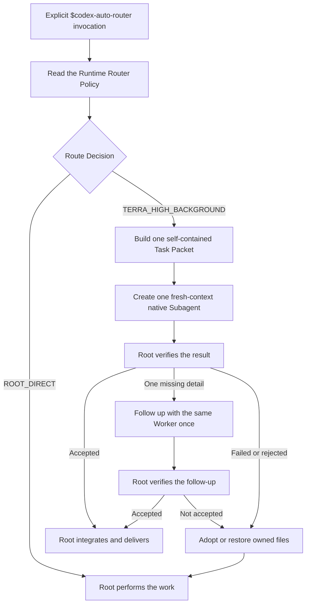

# Codex Auto Router — V1 Solution

Status: the Personal Usage Dashboard is implemented. The explicit Auto Router
Skill is packaged in this repository and must be installed before Codex can
discover it.

## Outcome

V1 reduces unnecessary work on an expensive Root Model without introducing a
second scheduler or second routing authority. Root keeps user intent,
integration, verification, and final delivery.

## P1 invariant: one routing authority

[Runtime Router Policy](../skills/codex-auto-router/references/routing-policy.md)
is the only normative source for route eligibility, the Worker model and
effort, and fallback behavior. `SKILL.md`, lifecycle references, this solution,
research notes, diagrams, Dashboard, and Wiki pages are explanatory or
mechanical; they cannot override the Policy.

The Policy cannot run for a task while another active policy selects models or
routes for that same task. An unrelated installed package does not need to be
uninstalled. A platform-level rejection or mandatory runtime constraint causes
the safe `ROOT_DIRECT` fallback.

## Runtime



V1 selects at most one bounded work unit for a Terra High Worker; all other
work remains with Root. The Worker receives a fresh context and never creates
descendants. Root issues a compact, task-local route receipt in commentary for
each decision. The receipt is not persisted, does not reach the Dashboard, and
is never a routing input.

## Cost and correctness guard

Delegation is allowed only when the exact owned paths are exclusive, the work
is restorable or safely discardable, and Root can mechanically verify the
output without reproducing the Worker’s reasoning. This prevents the most
expensive failure shape: costly delegation followed by costly Root rework.

Terra High is a quality-first V1 setting rather than a claim that every High
effort task is cheaper. After a human reviews at least five available route
receipts and outcomes, the team may decide whether to test a lower effort. V1
does not collect those records automatically or adapt its routing.

## Install and enable

`skills/codex-auto-router` is the project-controlled source, not an automatic
Codex discovery location. Install one copy or symlink into Codex’s Skill home,
then restart or reload Codex.

The following symlink procedure is deliberately non-overwriting. It stops if
the destination already exists, including an existing symlink:

```sh
router_source="$(git rev-parse --show-toplevel)/skills/codex-auto-router"
router_skill_home="${CODEX_HOME:-$HOME/.codex}/skills"
router_target="$router_skill_home/codex-auto-router"

test -d "$router_source"
test ! -e "$router_target" && test ! -L "$router_target" || {
  echo "Refusing to replace existing $router_target" >&2
  exit 1
}
mkdir -p "$router_skill_home"
ln -s "$router_source" "$router_target"
test "$(realpath "$router_source")" = "$(realpath "$router_target")"
```

For a copied installation, use the same preflight through `mkdir -p`, then run
`cp -R "$router_source" "$router_target"` only when the destination is absent.
After restart/reload, invoke it only with `$codex-auto-router`. A real explicit
invocation remains the required integration proof; static metadata and a
successful symlink do not prove runtime discovery.

## Relationship to Codex Model Routing Team

This Skill is a controlled, reduced adaptation of
[`zjp1997720/zhijian-skills`](https://github.com/zjp1997720/zhijian-skills/tree/main/skills/codex-model-routing-team)
at commit `eff93b823980a3cdadd1e362e54dc364553cc718`.

It adapts a self-contained Worker Task Packet and the native Subagent
lifecycle. It does not import the upstream route policy, App Thread lifecycle,
provider registry, durable mode, route scripts, or Worker ledger. The upstream
Skill is not invoked at runtime, and updates never merge automatically into the
Runtime Router Policy. File-level provenance and the scoped upstream MIT notice
are in the [Skill source record](../skills/codex-auto-router/SOURCE.json).

## Dashboard boundary

The Dashboard is an independent, local observation tool. Codex App Server
supplies aggregate Credit, local session summaries supply model-token shares,
and per-model Credit remains an estimate. Refresh and JSON export are user
initiated.

No Dashboard value is read during a Route Request. Model history, current
Credit pressure, Jira content, and personal behavior do not modify V1 routing.

## V1 boundaries

- Explicit invocation only.
- One native Worker at most per invocation and one follow-up at most.
- One Worker model and reasoning effort.
- No Luna route, App Thread route, replacement Worker, or automatic escalation.
- No routing telemetry, personalization, Jira adapter, or dynamic Credit rule.
- Safe fallback is `ROOT_DIRECT`.

## Validation

Repository tests enforce the Runtime Router Policy marker, exact decision
tokens, native parameters, one-Worker/one-follow-up limits, local Skill links,
and absence of known stale documents or references. They also verify that a
route receipt cannot be persisted, read by the Dashboard, or reused as a route
input. The Skill folder is validated with the official Skill validator.
