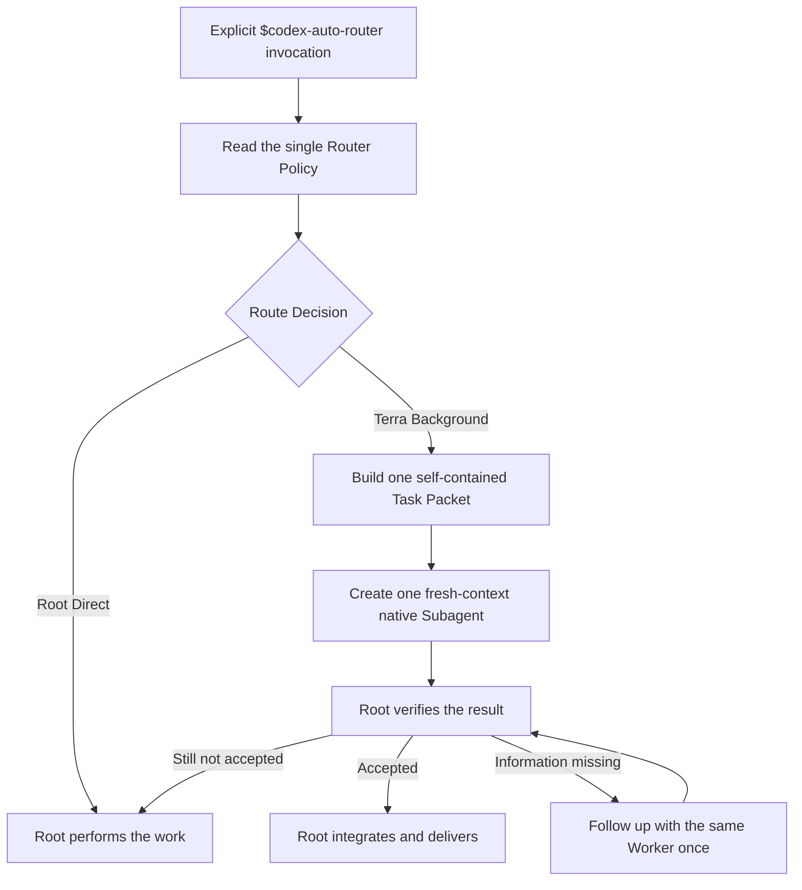

# Codex Auto Router — V1 Solution

Status: the Personal Usage Dashboard is implemented; the explicit Auto Router
Skill is packaged in this repository.

## Outcome

V1 reduces unnecessary work on an expensive Root Model without introducing a
second scheduler or a second routing policy. Root remains responsible for user
intent, integration, verification, and the final answer.

## P1 invariant: one routing authority

[The Skill's routing policy](../skills/codex-auto-router/references/routing-policy.md)
is the only normative source for:

- whether work stays with Root or is delegated;
- the exact Worker model and reasoning effort;
- the retry and fallback path.

`SKILL.md`, lifecycle references, this solution, research notes, diagrams, the
Dashboard, and Wiki pages are explanatory or mechanical. They cannot override
the Router Policy.

## Runtime

V1 has no LOW/MEDIUM/HIGH classifier and no Planner/Advisor/Executor workflow.
It does not replace the user's Root Model. It selects at most one bounded work
unit for a Terra High Worker; all other work remains with Root.

The Router is explicit-only in V1. Automatic activation through `AGENTS.md` is
deferred until the team has reviewed real results.

## Relationship to Codex Model Routing Team

This Skill is a controlled, reduced fork of
[`zjp1997720/zhijian-skills`](https://github.com/zjp1997720/zhijian-skills/tree/main/skills/codex-model-routing-team)
at commit `eff93b823980a3cdadd1e362e54dc364553cc718`.

The fork retains and simplifies two proven mechanisms:

- a self-contained Worker Task Packet;
- the native Subagent lifecycle with fresh context, one follow-up, and Root
  verification.

It deliberately does not import the upstream routing policy, App Thread
lifecycle, provider registry, durable mode, route scripts, or worker ledger.
The upstream Skill is not installed or invoked at runtime. Updates are reviewed
manually; they are never merged automatically into the Router Policy.

## Dashboard boundary

The Dashboard is an independent, local observation tool:

- Codex App Server supplies the authoritative aggregate Credit snapshot.
- Local session summaries supply model-token shares.
- Per-model Credit is an estimate, not an official billed split.
- Refresh and JSON export are user initiated.

No Dashboard value is read during a Route Request. Model history, current
Credit pressure, Jira content, and personal behavior do not modify V1 routing.

## V1 boundaries

- Explicit invocation only.
- One native Worker at most per invocation.
- One Worker model and one reasoning effort.
- No Luna route.
- No App Background Thread route.
- No model escalation or replacement Worker.
- At most one follow-up to the original Worker.
- Safe fallback is Root Direct.
- No routing telemetry, personalization, Jira adapter, or dynamic Credit rule.

Luna can be evaluated later for mechanical, batch, directly verifiable work.
That requires a deliberate change to the same Router Policy, not an additional
policy layer.

## Validation

Repository tests enforce that:

- no ADR remains under `docs/adr/`;
- the Skill reads the single Router Policy;
- exact model identifiers do not appear in other Skill runtime files;
- the Skill metadata remains explicit-only.

The Skill folder is also validated with the official Skill validator.
